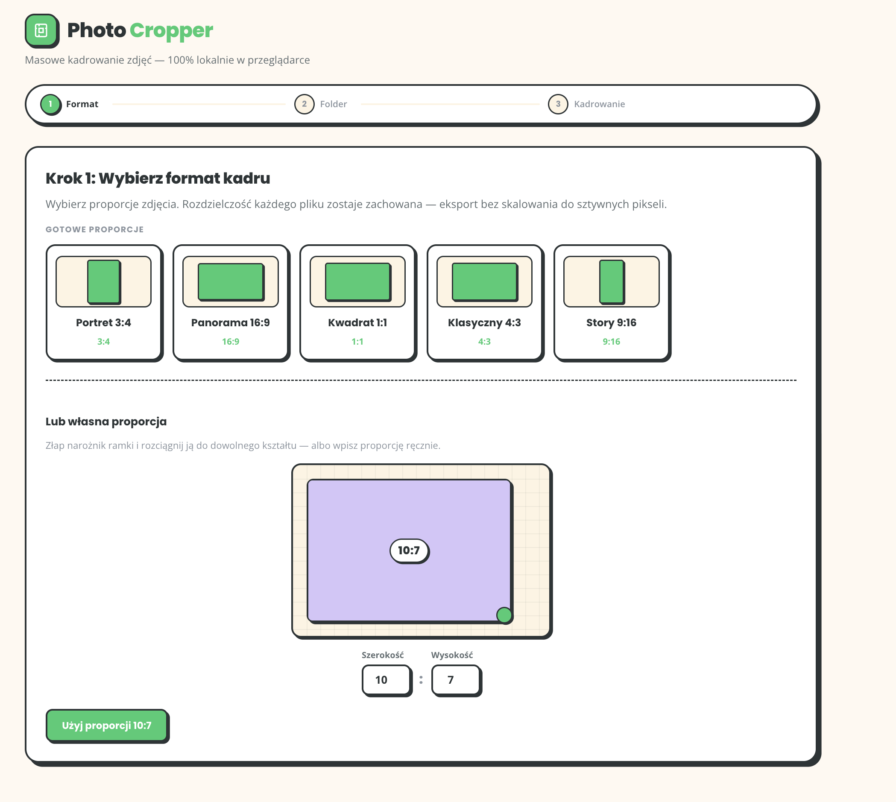

# Photo Cropper

Webowe narzędzie do szybkiego, masowego kadrowania zdjęć pod montaż wideo i szablony graficzne.
Aplikacja działa lokalnie w przeglądarce (Chrome/Edge), bez wysyłania zdjęć do chmury.

<p align="center">
  
  
</p>

<p align="center">
  <em>Lewo: wybór proporcji · Prawo: kadrowanie z auto-propozycją twarzy</em>
</p>

## TL;DR

- Batch crop zdjęć w 3 krokach: format (proporcje) -> folder -> kadrowanie
- AI face detection (MediaPipe) do automatycznej propozycji kadru
- Obsługa wielu twarzy + ostrzeżenie, gdy nie da się zmieścić wszystkich
- Eksport do `cropped/` z zachowaniem nazw plików
- Pełne przetwarzanie lokalne (privacy-first)

## Dlaczego ten projekt

Projekt powstał jako odpowiedź na realny problem: ręczne kadrowanie dużych paczek zdjęć pod montaż wideo i szablony graficzne jest czasochłonne i podatne na niespójność.

Celem było zbudowanie narzędzia, które:
- minimalizuje liczbę kliknięć,
- zachowuje spójność kadrów,
- daje kontrolę ręczną tam, gdzie automatyka nie wystarcza.

## Kluczowe funkcje

### 1) Wybór formatu (UX-first)
- Graficzne karty presetów proporcji (Portret 3:4, Panorama 16:9, Kwadrat 1:1, Klasyczny 4:3, Story 9:16)
- Własna proporcja przez interaktywną ramkę (drag krawędzi N/S/E/W)
- **Bez wymuszania rozdzielczości w px** — każde zdjęcie zachowuje natywną rozdzielczość wyciętego fragmentu

### 2) Tryb batch
- Wybór folderu źródłowego
- Kolejka zdjęć JPG/PNG/WebP
- Szybki workflow zatwierdzania i przechodzenia dalej

### 3) Dwupanelowy edytor kadru
- Lewy panel: oryginał + przesuwalna ramka crop
- Prawy panel: wynik końcowy na żywo
- Synchronizacja paneli w czasie rzeczywistym
- Zoom i pan + skróty klawiaturowe

### 4) Face-aware auto-crop
- Auto-centrowanie na twarzy (bez wymuszania skali)
- Dla wielu twarzy: próba zmieszczenia wszystkich
- Gdy to niemożliwe: żółta ramka ostrzegawcza

### 5) Eksport i bezpieczeństwo danych
- Zapis do `cropped/` w obrębie wybranego folderu
- Te same nazwy plików
- Cofnij i ponowny zapis = nadpisanie pliku (bez duplikatów)
- 100% local processing

## Stack technologiczny

- Frontend: React + TypeScript + Vite
- Computer Vision: MediaPipe Face Detection (WASM)
- Obróbka obrazu: HTML Canvas
- File I/O: File System Access API


### Start

```bash
npm install
npm run dev
```

### Build produkcyjny

```bash
npm run build
npm run preview
```

## Przepływ użytkownika

1. Wybór formatu / proporcji (preset lub własny)
2. Wybór folderu ze zdjęciami
3. Dla każdego zdjęcia:
   - auto-propozycja kadru,
   - ręczna korekta (pan/zoom, przeciąganie ramki),
   - podgląd rozdzielczości wyjściowej w px (zależnej od źródła),
   - zapis / pominięcie / cofnięcie
4. Eksport do `cropped/` w natywnej rozdzielczości wyciętego fragmentu

## Architektura (skrót)

```text
src/
├── components/
│   ├── DimensionPicker.tsx
│   ├── FolderPicker.tsx
│   ├── CropSession.tsx
│   └── CropWorkspace/
├── hooks/
│   └── useSession.ts
├── lib/
│   ├── crop.ts
│   ├── faceDetection.ts
│   └── export.ts
└── types.ts
```

## Decyzje projektowe

- Offline-first: prywatność i brak kosztów backendu
- Human-in-the-loop: AI proponuje, użytkownik zatwierdza
- Spójność ponad "magiczne" auto: stałe proporcje, przewidywalne zachowanie
- Zachowanie jakości: eksport bez skalowania do sztywnych pikseli
- Czytelny UX: dwupanelowy podgląd i szybkie skróty

## Ograniczenia / TODO

- Brak rekurencyjnego skanowania podfolderów
- Brak PWA/service worker
- Brak EXIF auto-rotate
- Brak zapisanych presetów użytkownika
- Brak trybu auto-accept batch

## Informacja o AI

Projekt został zaprojektowany i rozwijany z wykorzystaniem narzędzi sztucznej inteligencji (AI), które wspierały implementację, testowanie i dokumentację.

## Licencja

Projekt stworzony przez Marcina Pawlaka 
